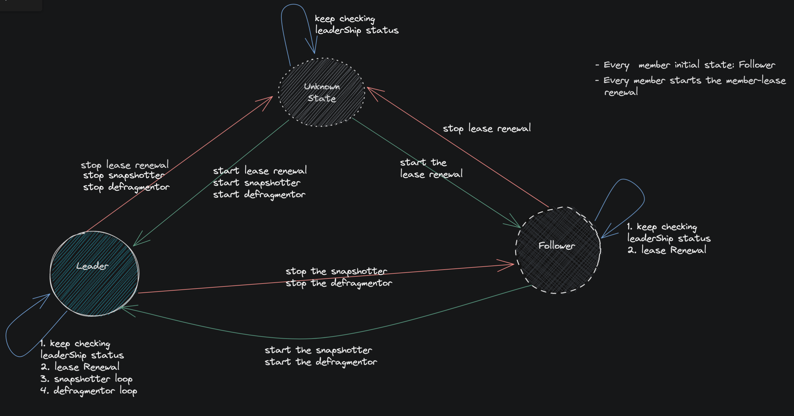

### Leading ETCD main container’s sidecar is the backup leader 

- The `backup-restore sidecar` poll its own etcd main container to see if it is the leading member in the etcd cluster.
This information is used by the backup-restore sidecars to decide that sidecar of the leading etcd main container is the `backup leader`.

- Only `backup leader` sidecar among the members have the responsibility to take/upload the snapshots(full as well as incremental) for a given Etcd cluster as well as to [trigger the defragmentation](https://github.com/gardener/etcd-druid/tree/master/docs/proposals/multi-node#defragmentation) for each Etcd cluster member. 

### Work flow

Backup-restore can be in following 3 states:
1. Follower:
   - DefaultState for every backup-restore member is `Follower` State.
   - If it's corresponding etcd main container is a `Follower` etcd.
2. Leader:
   - If its own etcd main containers becomes the `leader` then sidecar will also become `leading sidecar`.
3. Unknown:
   - If there is no etcd leader present or Quorum loss.
   - If corresponding etcd main container is down and [endpoint status](https://github.com/etcd-io/etcd/blob/f82b5cb7768dacad9fb310232c1383b4e6718378/client/v3/maintenance.go#L53) api call fails.

### Backup

- Only `backup leader` among the backup-restore members have the responsibility to take/upload the snapshots(full as well as incremental) for a given Etcd cluster. 
- `backup leader` also have the responsibility to [garbage-collect](https://github.com/ishan16696/etcd-backup-restore/blob/leaderElection-doc/doc/usage/getting_started.md#taking-scheduled-snapshot) the backups according to configured garbage collection policy.

### Member-lease

Each backup-restore member have the responsibility to renew its member lease periodically, this will work as heartbeat and indicates that backup-restore cluster members are in `Healthy` State.

### Defragmentation

Defragmentation is performed only by the `leading backup-restore` sidecar. The defragmentation is performed only when etcd cluster is in full health and it is done in a rolling manner for each members to avoid disruption. Defragmentation is triggered on all etcd follower then at last on leading etcd member.

### Complete work flow leader-election state diagram.

