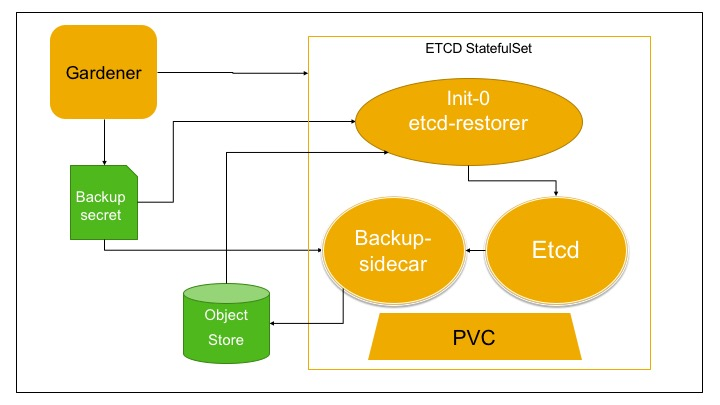
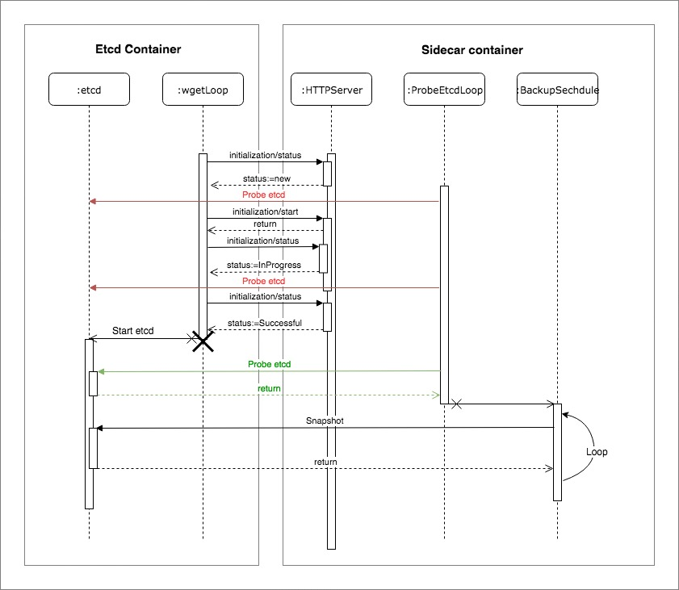

# Etcd backup restore design

## Goal

Main goal of this project to provide a solution to make [etcd] instance backing the kubernetes cluster robust to failures. Etcd data is backed up at regular intervals. The etcd instance runs on a Seed Kubernetes cluster and stores the state of the Shoot Kubernetes clusters. In case of etcd instance failures, the etcd instance is reconciled and in the extreme case restored from the latest non-corrupt backup available.

## Non Goal

- Volume failures like EBS volume failures, PVC and PV deletion after etcd deletion (when the shoot goes down) are not handled at this moment. However, checks and remedial steps for the failure types mentioned previously will be implemented over time/later.
- Allowing the user to pick from a list of backups or even point-in-time-recovery (PiTR) is not planned, because there is no reliable infrastructure reconciliation implemented in Kubernetes and the CRD extension concept (or API server extensions) allows to have resources with impact on the external/physical world that would not be reconciled either (if we are to restore a backup which is not the latest).
- Backup validation is not repeatedly done, i.e. once a backup is taken, we assume the infrastructure preserves it in a healthy state (we do not validate backups by rehashing them and comparing them with initially taken hashes).

## Design

### Assumption

- Etcd cluster is a single member cluster (Shoot cluster environment, much like a master in a Borg-hosted GKE cluster).

- Etcd instance will be deployed as a StatefulSet with a PVC for its persistence, which will bring free reconciliation.

### Requirements

- ETCD pod fails and PVC with valid data directory is available: Etcd pod should restart and attach to same PVC to continue from last state before failure.

- Data corruption check: There should be mechanism to check etcd failure due to etcd data directory corruption.

- Data directory unavailable but backups available in the cloud store: Restore Etcd from the latest backup.

- Backup etcd snapshots on different cloud object-stores.

### Rely on K8s for the Following

- PVC deleted - Doesn't necessarily detach volume if in use.
- IaaS failure
  - Storage Volume detached: PV reattaches to the same volume. Restoration of Etcd data directory not required.
  - Storage Volume deleted: Expect StatefulSet to be robust to such failures. Restoration of etcd data directory necessary.
  - Node failure: K8s should reschedule the pod on a different node. Restoration of Etcd data directory not required.
  - ETCD Pod scheduling failed: Can’t do much (look pod configuration parameter for critical-pods).

## Architecture

We will have a StatefulSet for etcd with two containers in it.

- ETCD container
- Sidecar container

### ETCD Container

- Request the sidecar to validate/initialize the data directory.
- The etcd process is started only if the `initialize` request to sidecar returns a success.

### Sidecar Container

Sidecar container has two components

- Initializer
- Prober

#### Initializer

- On request from the Etcd container, check the data directory for data corruption.
- if data directory is corrupt, restore the data directory from the latest snapshot.
- return successful response on validation/restoration of data directory.

#### Prober

- Probe etcd container for liveliness of etcd process.
- Probe is required to ensure that etcd is live before backups are triggered.
- Schedule the backup operation (probably using cron library) which triggers full snapshot at regular intervals.
- Store the snapshot in the configured cloud object store.

**Init container is not used for the validation/restoration of etcd data directory. The rationale behind the decision was to avoid baking in pod restart logic in sidecar container in the event etcd process had died. In case etcd container died, init-container had to be run before etcd container was run to ensure that data directory was valid. This required the pod to be restarted. With the current design, the sidecar handles the data directory validation/restoration and periodic backups. Pod restart is not required.**

## Workflow

### Etcd container

1. Etcd container starts and requests the sidecar for data directory initialization. It waits for the response.
2. On response,
    1. in case of success, start etcd process.
    2. in case of failure/timeout, exit with error. (Container restarts)

### Sidecar container

1. Start periodic liveliness prober on etcd. Start http server to serve `initialize` requests.
2. On receiving an `initialize` request, check the data directory for corruption.
    1. In case of data directory corruption, restore data directory from the latest cloud snapshot. Return success.
    2. In case data directory is valid, return success.
    3. In all other cases, return failure.
3. Once the `initialize` request returns success, etcd process can be expected to start up in some time. The prober would then receive a successful probe of etcd's liveliness.
4. On successful probe, start taking periodic backup of etcd and store the snapshot to the cloud object store. Stop prober.
    - In case of a failure to take a backup, exit with error. (Container restarts)

### Handling of Different Scenarios/Issues

- DNS latency: Should not matter for single member Etcd cluster.
- Etcd upgrade and downgrade for K8s compatibility: Should not be issue for v3.* series released so far. Simply restart pod. No data format change.
- IaaS issue: Issues like unreachable object store, will be taken care by init container and backup container. Both container will keep retrying to reach out object store with exponential timeouts.
- Corrupt backup: StatefulSet go in restart loop, and human operator will with customers concern delete the last corrupt backup from object store manually. So that, in next iteration it will recover from previous non-corrupt backup.

## Outlook

We want to develop incremental/continuous etcd backups (write watch logs in between full backups), to ensure our backups are fresh enough to avoid discrepancies between etcd backup and external/physical world.

[etcd]: https://github.com/coreos/etcd
