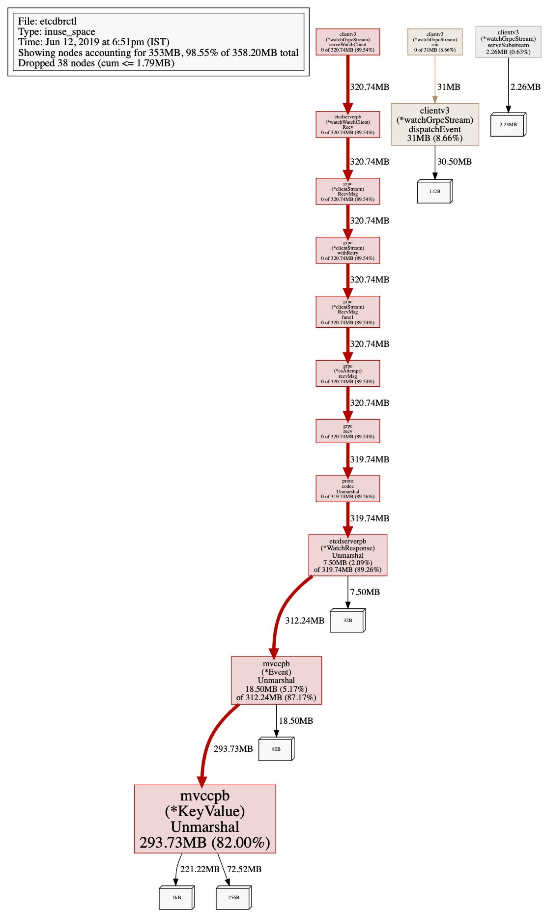
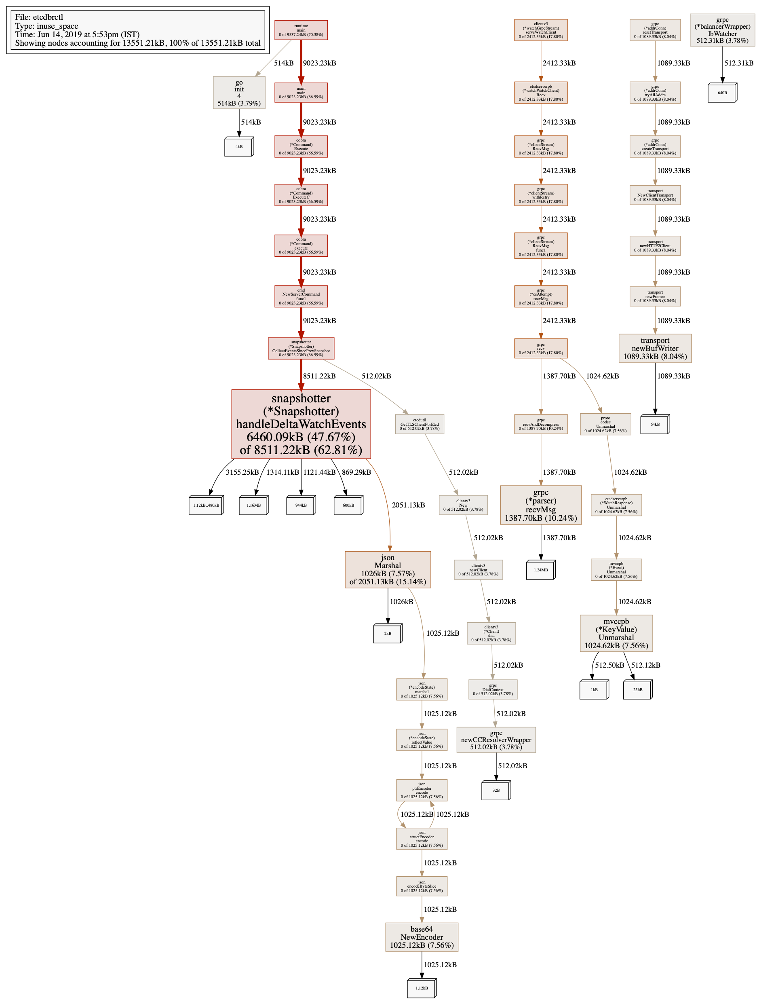

# Handle high watch event ingress rate

## Problem statement
For large key-value sizes of etcd and watch on etcd yielding responses at a high rates, we see that the backup sidecar memory shoots up drastically but linearly.

## Reason

The memory consumption surge is associated with the watch implementation in the client library. 
As can be seen [here](https://github.com/etcd-io/etcd/blob/master/clientv3/watch.go#L814), when the ingress rate of the events are more than the egress rate from the watch response channel the buffers holding the events tend to bloat. There is no throttling done between etcd and the client. Even if throttling was done, we would not be able to depend on it. As the revision of etcd would have moved ahead and due to throttling the watch events would be far behind. This lag could get progressively worse if the load on etcd persists. We would have to implement a different approach to watches if we stumble upon this issue in realtime.

When the delta snapshot logic was changed to run multiple goroutines to drain the watch channel and to short circuit writing the delta to cloud but instead just drop it, we see that the memory pressure on the watch client is drastically reduced. The finding is shown in the image below.

## Solution

There are two areas to address in order to arrive at a solution:

* Fix the watch implementation of etcd client to throttle the ingress of watch response events from etcd. Implement a fix avoid the unchecked growth of [buffer](https://github.com/etcd-io/etcd/blob/master/clientv3/watch.go#L814) so as to prevent the OOM Kill.
* Try a polling-based approach (with parallel download of chunks of revisions) as against the watch-based approach now. The delta revisions yet to be archived in the cloud store can be polled in chunks. The amount of memory consumed from as part of the poll based events fetch can be done in a controlled manner.
