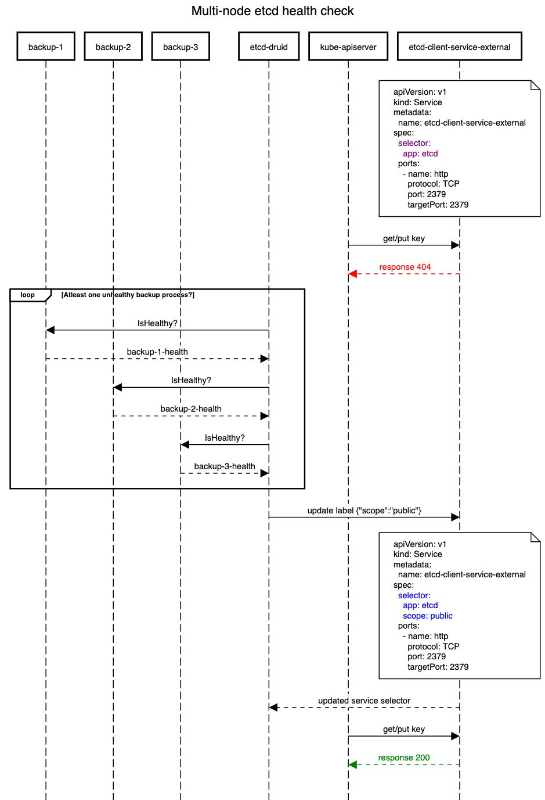

# Multi-node etcd cluster backup and restore

## Goal

- Backup etcd cluster deployed with more than one number of nodes to different cloud providers
- Restore the partially down(only some of total etcd nodes down) or fully down (all of the etcd nodes are down) etcd cluster
- For etcd storing only events of Kubernetes cluster, same solution should be able to restart cluster from scratch in case its fully down without having any backup.

## Non-goal

- Recover etcd cluster even if it is deployed across availability zone or across region

## Problem points with extensibility of existing solution

- Bootstrap: etcd needs to know the all members before hand
- Backup-restore sidecar and etcd should be able to talk to each other
- Backup:
    - snapshot should be taken always from the leader in etcd cluster
    - Backup sidecar deployed with each etcd node should coordinate to have single leader pushing snapshot to backup store
- Restore:
    - Minority etcd nodes down let etcd to self heal
    - Majority down restore it from backup store
    - Make use of non-corrupt data in PV for optimization purpose by avoiding unnesessary restore

## Design

### Bootstrap
- We will have fix service DNS and port.
- Fix number of nodes in etcd cluster.
- Dynamic changing of number nodes will be out-of-scope. (Could be introduced later)

### Backup

We will be having backup sidecar along each node of etcd, since backup sidecar does more job like defragmentation, initial validation and restoration of etcd. Now, since we don't want redundant backup from multiple backup sidecar we will have to introduce leader election amongst them. In addition, Etcd client redirects all snapshot request to leader, making backup sidecar near etcd leader will be obvious choice for backup leader.  Since backup thread starts after the etcd bootstrap, it can leverage the leader election from etcd to decide which will take backups.

So, from implementation perspective we have to modify the backup sidecar to be aware of etcd leader and start the periodic backups thread only if its place alongside the leader. It doesn't have to implement the leader election from scratch.

### Restore
Different actions needed for recovery of etcd cluster based on the current etcd cluster state are as follows. For simplicity we consider cluster size to be 3.

|Events|etcd1-leader|etcd2|etcd3|Backup|Action|
|------|-----|-----|-----|------|------|
|a follower etcd goes down lagging behind backup |rev18- up| rev13-up| rev 18- down | rev14| Restore from backup and restart etcd. Though simple restart should also work |
|a follower etcd goes down with revision ahead of backup|rev18- up| rev15 up| rev 18- down | rev14| Restart that etcd and let self heal/sync |
|a leader etcd goes down| rev18- down| rev18-up| rev13-up | rev14| Restart that etcd and let self sync|
|majority etcd down|rev18- down|rev13- down|rev18-up|rev14|Restart etcd and let self sync|
|minority of follower db corrupt| rev18- up| rev13-up| corrupt| rev14|Restore from  snapshot and start etcd |
|leader corrupt |corrupt|rev15-up|rev-13up|rev14|Take current snapshot and restore |
|majority db corrupt except leader|rev*|corrupt|corrupt|rev14|take current snapshot and restore entire cluster from that |
|majority db corrupt including leader|corrupt|corrupt|rev*|rev14|***if current revision greater than backup take current snapshot and restore entire cluster from that |

Of course we current setup the above individual action will be satisfied and the restore will work as expected. Only additional change required to current backup sidecar to go through the disaster recovery successfully, is following,
While introducing leader election, on each leader change observation make backup sidecar unhealthy and trigger snapshot. Post successful snapshot only the backup sidecar should be made healthy and new request from apiserver are allowed to etcd. This is to specially avoid the revision and data inconsitancy in case of last three scenarios listed above.

### Health check
Previously, we used to have readiness probe on etcd container pointing to health check. This is used to prevent etcd to be accessible to external world, to be precise kube-apiserver in case backup sidecar had any issue.

With multi-node-etcd, every etcd node living in different cluster have to communicate with each other to bootstrap. For this reason, we will have `etcd-internal` service over each etcd member exporting both client port `2379` and server port `2380`. If we point kube-apiserver to same service, it will try to update etcd event when backup procedure is not working as expected.

Hence, we will have separate `etcd-client-external` service which exposes only the client port `2379` to outside etcd setup. The kube-apiserver will be configured to point to this service. Since kubernetes doesn't support service specific readiness probe, we will play around the `selector` in both the service to coordinate the etcd readiness with health of backup sidecar. We will use etcd-druid to have health check on backup-sidecar. On successful health probe on all backup sidecar the etcd-druid will make this service available. On failure of health probe it will update service by removing selector label  `scope: public`, so that the service won't find appropriate etcd pod and fail to serve traffic. Please follow the sequence diagram for more clear idea of flow.

