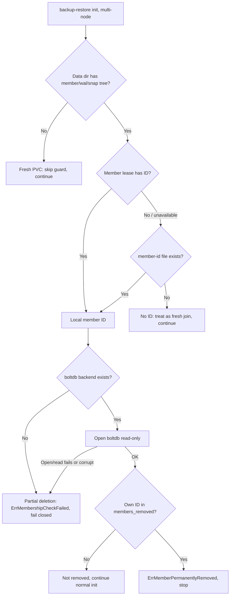

# Anti-rejoin guard

When a multi-node etcd cluster is scaled in, `etcd-druid` removes an etcd member from the cluster before the corresponding StatefulSet pod is terminated. In the short window between the member removal and the pod termination, the pod can still restart with its old data directory.

Without a guard, `etcd-backup-restore` interprets the state *"this pod has local etcd data, but its member ID is not present in the live cluster"* as a scale-out case and re-adds the removed member as a learner. `etcd-druid` removes it again, the same pod re-adds itself, and the cluster enters a remove/re-add loop.

The anti-rejoin guard closes this loop. On a multi-node cluster it runs on every startup **before** the membership and scale-up checks, whenever the data directory already holds an etcd member tree (`member/`, `wal/`, `snap/`). It runs regardless of whether the member lease is still alive — a stale lease must not be allowed to bypass the tombstone check. If the local member was explicitly removed from the cluster, startup stops with `ErrMemberPermanentlyRemoved` instead of re-adding the member.

This feature backs [etcd-druid DEP-08 (Scaling-in a multi-node etcd cluster)](https://github.com/gardener/etcd-druid/blob/master/docs/proposals/08-scale-in.md).

## How a removed member is detected

etcd records removed member IDs in the local boltdb backend's `members_removed` bucket when `MemberRemove` is applied. This is the local member's tombstone. The guard inspects two on-disk artefacts of the local etcd data directory:

- The **local member ID**, resolved in priority order:
  - **Member lease** — the heartbeat writes the member ID into the lease holder identity as `<memberID-hex>:<clusterID-hex>:<role>` on every renewal. Reading it is a single cheap API call, so it is tried first.
  - **Member-id file** (`<data-dir>/member-id`) — the heartbeat also writes the same holder-identity string to this file on every renewal, *before* patching the lease. The write-before-patch ordering ensures the file is always at least as fresh as the lease. The guard falls back to this file when the lease is genuinely absent (`NotFound`); other lease errors (RBAC denial, network timeout, unparseable holder identity) are logged and also fall back to the file, so a transient API blip does not permanently block the member.
  - If neither source yields an ID (fresh member, no lease yet, no file yet), the guard treats the pod as a fresh join and continues normally.
- The **`members_removed` bucket** in the boltdb backend (`<data-dir>/member/snap/db`), opened read-only.

If the resolved local member ID is present in `members_removed`, the cluster has explicitly removed this member and the sidecar must not re-add it.

## Design decisions

The check is deliberately conservative and **fails closed** — when it cannot be sure a member is safe to re-add, it stops startup rather than risk re-joining a removed member:

- If the data directory state **cannot be determined** (the `member/`, `wal/`, `snap/` structure check itself errors), the guard fails closed.
- If **no local member ID** can be resolved (neither lease nor member-id file), there is nothing to check, so normal initialization continues.
- If a local member ID **is** resolved but the **boltdb backend file is missing**, the WAL tree is present but the db is not — a possible partial PVC deletion. The guard cannot safely treat this as a fresh member, so it fails closed.
- If the boltdb exists but **cannot be opened** (the read-only open is bounded by a lock-acquisition timeout to ride out transient lock contention) or is **corrupt** (bolt panics are recovered and surfaced as errors), the guard fails closed. The process then exits and is restarted by the crash-back-off loop.
- Only the **local member's own ID** is considered. Entries for other removed members are ignored.

Opening boltdb **read-only** ensures the guard cannot corrupt a live backend, and reading only the small `members_removed` bucket keeps runtime and memory overhead negligible. This follows the same access pattern — including recovering from bolt panics on a corrupt backend — already used by `etcd-backup-restore`'s data validator (`getLatestEtcdRevision`).

## Operational behaviour

When the guard fires, the sidecar stops initialization with `ErrMemberPermanentlyRemoved` and the pod does not join the cluster; it is expected to be terminated by the scale-in that removed the member. This is the intended outcome — the member was decommissioned on purpose.

The guard does **not** interfere with the normal restoration path. A member that is still legitimately part of the cluster has never been added to `members_removed`, so the guard reads the tombstone, finds nothing, and lets the existing membership and single-member restoration flow run unchanged. Running the guard *before* the membership check is deliberate: it ensures a member with a stale-but-alive lease still has its tombstone inspected instead of being waved through.

## Limitation

The guard relies on the `members_removed` tombstone, which lives in the member's **own** data directory. If that data directory is wiped or restored — the member-id file, the boltdb backend, or both missing or unreadable — there is no tombstone to consult, so the member is treated as a fresh join and may be re-added as a learner. This case is outside the guard's reach by design (there is nothing on disk to read). The backstop is the `etcd-druid` controller: scale-in detection re-derives the target set on every reconcile and removes the surplus member again under its per-cycle quorum-safety check, so a member restarting with a wiped or restored data directory cannot persist in the cluster after a scale-in.
