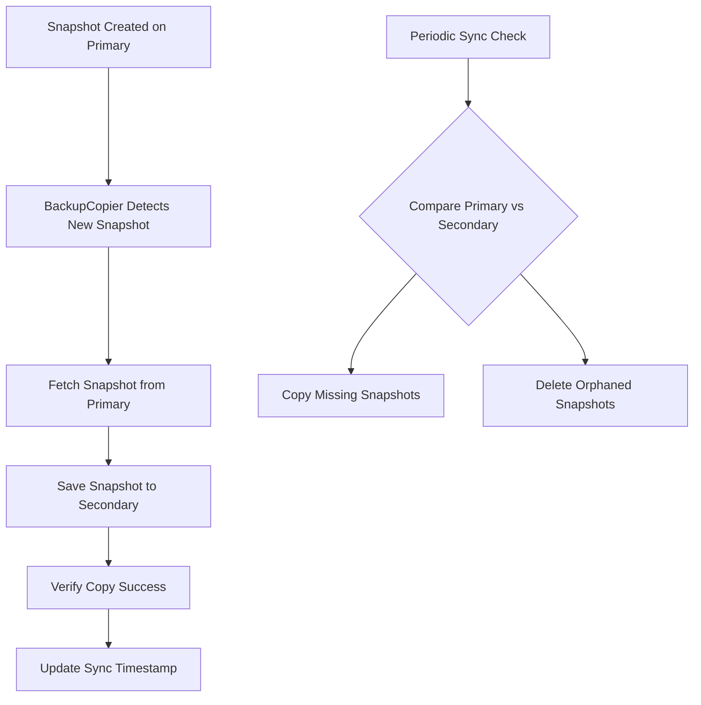
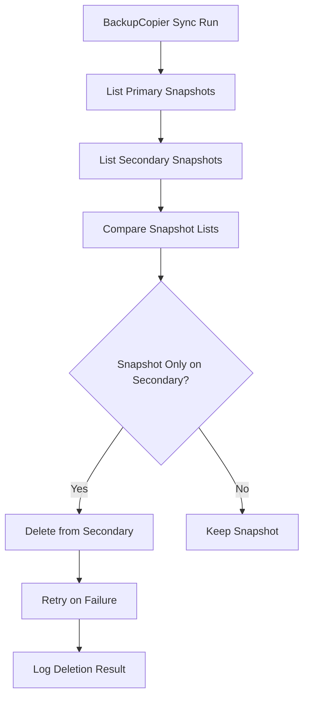

# Enabling Dual S3 Endpoint Support

The etcd-backup-restore tool supports dual-endpoint configuration, which allows snapshots to be stored simultaneously on two different storage endpoints. This feature provides enhanced data redundancy and fault tolerance by maintaining synchronized backups across multiple storage backends.

## Overview

The dual-endpoint feature works by:
- Storing all snapshots to a **primary endpoint** (the main storage)
- Automatically copying snapshots to a **secondary endpoint** (backup storage)
- Synchronizing snapshots between endpoints using a background copier service

## Configuration

### Basic Configuration

To enable dual-endpoint support, configure both primary and secondary storage endpoints using command line arguments:

```bash
etcd-backup-restore server \
  --storage-provider="S3" \
  --store-container="my-primary-bucket" \
  --store-prefix="etcd-backups" \
  --secondary-storage-provider="S3" \
  --secondary-store-container="my-secondary-bucket" \
  --secondary-store-prefix="etcd-backups-secondary" \
  --backup-sync-enabled=true \
  --backup-sync-period="5m"
```

### Environment Variable Configuration

You can also configure dual endpoints using environment variables:

```bash
# Primary endpoint
export STORAGE_CONTAINER="my-primary-bucket"
export STORAGE_PROVIDER="S3"

# Secondary endpoint
export SECONDARY_STORAGE_CONTAINER="my-secondary-bucket"
export SECONDARY_STORAGE_PROVIDER="S3"
export SECONDARY_AWS_APPLICATION_CREDENTIALS_JSON="/path/to/secondary/credentials"
```

### Advanced Configuration Options

```bash
etcd-backup-restore server \
  --backup-sync-period="3m" \                           # How often to check for new snapshots
  --backup-sync-max-retries=5 \                         # Maximum retry attempts for failed copies
  --backup-sync-retry-backoff="30s" \                   # Delay between retry attempts
  --backup-sync-concurrent-copies=10 \                  # Maximum concurrent copy operations
  --secondary-min-chunk-size=10485760 \                 # 10MB chunk size for secondary
  --secondary-max-parallel-chunk-uploads=8              # Parallel uploads for secondary
```

## How Copying Works

### Synchronization Mechanism

The dual-endpoint feature uses a **BackupCopier** service that:

1. **Initial Synchronization**: When started, performs an immediate sync of all existing snapshots
2. **Periodic Synchronization**: Runs background sync operations at configured intervals
3. **Snapshot Comparison**: Compares snapshots between primary and secondary using unique keys based on:
   - Snapshot directory
   - Snapshot name
   - Start and end revision numbers
4. **Concurrent Operations**: Handles multiple copy operations simultaneously for efficiency

### Copy Process Flow



### Snapshot Identification

Each snapshot is identified using a unique key format:
```
{directory}/{name}:{start_revision}-{end_revision}
```

This ensures accurate comparison and prevents duplicate copies.

## Object Deletion Behavior

### When Objects Are Deleted

Objects are deleted from the secondary endpoint in the following scenarios:

1. **Orphaned Snapshots**: When a snapshot exists on secondary but not on primary
2. **Cleanup Operations**: During garbage collection when snapshots are removed from primary
3. **Sync Reconciliation**: When the copier detects inconsistencies between endpoints

### Deletion Process



### Deletion Safety

- **Retry Logic**: Failed deletions are retried up to the configured maximum attempts
- **Error Handling**: Deletion failures are logged but don't stop the sync process
- **Immutability Support**: Respects object immutability settings and won't delete protected objects

## Error Handling and Resilience

### Endpoint Failure Scenarios

1. **Primary Endpoint Failure**:
   - If primary fails during initialization, it is treated as a fatal error

2. **Secondary Endpoint Failure**:
   - Primary continues to function normally
   - No copier is created (single endpoint mode)
   - Logged as warning

3. **Both Endpoints Fail**:
   - Returns error during initialization
   - Application startup fails

### Copy Operation Resilience

- **Automatic Retries**: Failed copy operations are automatically retried
- **Exponential Backoff**: Retry delays increase progressively
- **Concurrent Limits**: Prevents overwhelming endpoints with too many simultaneous operations
- **Context Cancellation**: Respects cancellation signals for graceful shutdown

## Monitoring and Observability

### Log Messages

The dual-endpoint feature provides detailed logging:

```
INFO: Creating snapstore with backup copier - Primary: S3/bucket1, Secondary: S3/bucket2
INFO: Starting backup copier...
INFO: Found 5 snapshots to copy and 2 to delete
INFO: Successfully copied all 5 snapshots to secondary
WARN: Only primary snapstore available, using single endpoint
ERROR: Failed to copy snapshot full-00001000-00002000-1234567890: network timeout
```

### Monitoring Points

Monitor these aspects for operational health:
- Sync operation frequency and duration
- Copy success/failure rates
- Endpoint availability
- Snapshot count consistency between endpoints

## Best Practices

### Configuration Recommendations

1. **Different Providers**: Use different cloud providers for primary and secondary endpoints for better fault tolerance
2. **Geographic Distribution**: Place endpoints in different regions or availability zones
3. **Appropriate Sync Period**: Balance between data freshness and system load (recommended: 3-5 minutes)
4. **Chunk Size Tuning**: Adjust chunk sizes based on network conditions and storage provider requirements

### Operational Considerations

1. **Network Bandwidth**: Ensure sufficient bandwidth between primary and secondary endpoints
2. **Cost Management**: Consider data transfer costs when using different cloud providers
3. **Access Permissions**: Ensure service accounts have appropriate permissions for both endpoints
4. **Monitoring**: Set up alerts for sync failures and endpoint unavailability

### Example Production Configuration

```bash
# Production dual-endpoint configuration
etcd-backup-restore server \
  --storage-provider="S3" \
  --store-container="prod-etcd-backups-primary" \
  --store-prefix="cluster-1/backups" \
  --secondary-storage-provider="GCS" \
  --secondary-store-container="prod-etcd-backups-secondary" \
  --secondary-store-prefix="cluster-1/backups" \
  --backup-sync-enabled=true \
  --backup-sync-period="5m" \
  --backup-sync-max-retries=3 \
  --backup-sync-retry-backoff="30s" \
  --backup-sync-concurrent-copies=5 \
  --min-chunk-size=5242880 \                            # 5MB
  --max-parallel-chunk-uploads=4 \
  --secondary-min-chunk-size=10485760 \                 # 10MB
  --secondary-max-parallel-chunk-uploads=6
```

## Troubleshooting

### Common Issues

1. **Sync Not Working**:
   - Verify `--backup-sync-enabled=true` is set
   - Check endpoint connectivity and credentials
   - Review logs for specific error messages

2. **High Sync Latency**:
   - Increase `--backup-sync-concurrent-copies`
   - Optimize chunk sizes for network conditions
   - Check network bandwidth between endpoints

3. **Snapshot Inconsistencies**:
   - Manually trigger sync using the one-time sync functionality
   - Verify both endpoints are accessible
   - Check for permission issues

### Diagnostic Commands

```bash
# Check snapstore configuration
etcd-backup-restore snapshot list --storage-provider=S3 --store-container=my-bucket

# Test secondary endpoint connectivity
etcd-backup-restore snapshot list --storage-provider=S3 --store-container=my-secondary-bucket
```

The dual-endpoint feature provides robust backup redundancy while maintaining operational simplicity through automated synchronization and comprehensive error handling.
