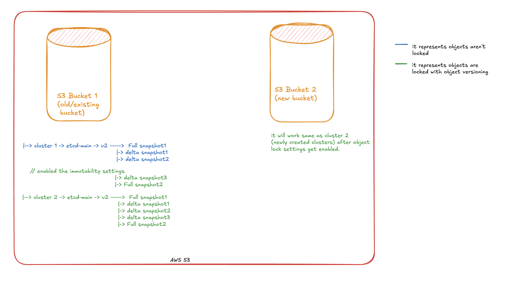

# Enabling Immutable Snapshots in `etcd-backup-restore`

This guide walks you through the process of enabling immutable snapshots in `etcd-backup-restore` by leveraging bucket-level immutability features for various object storage providers:

1. Google Cloud Storage (GCS)
2. Azure Blob Storage (ABS)
3. Amazon Simple Storage Service (AWS S3)

> [!Note]
> Currently, Openstack object storage (swift) doesn't support immutability for objects: https://blueprints.launchpad.net/swift/+spec/immutability-middleware.

---

## Overview

Enabling immutability of your bucket will ensure that your backups are tamper-proof and comply with regulatory requirements.
Currently, `etcd-backup-restore` supports bucket-level immutability for GCS, ABS and S3.

> [!Note]
> If immutability is not enabled then the objects i.e snapshots's immutability expiry time will be considered as zero, hence causing no effect on current functionality.

The consumer of `etcd-backup-restore` must have to enable the bucket lock with the appropriate settings on their buckets to consume this feature. This is because `etcd-backup-restore` doesn't manage or interfere with the bucket's (object store) lifecycle process.

> [!CAUTION]
> Locking an immutability policy is an irreversible action.

## Configure Bucket-Level Immutability

By configuring an immutability policy on your storage bucket/container, you ensure that all snapshots are stored in an immutable (Write Once, Read Many) state for a specified duration. This prevents snapshots from being modified or deleted until their immutability period expires.

### Enabling Immutability on Bucket

You can set a time-based immutability policy on your bucket/container. The immutability policy specifies the minimum duration for which the objects must remain immutable. This configuration can also be achieved using the cloud provider's respective console/portal. Here, we have just mentioned the CLI commands to configure it.

Please move to respective storage providers for configurations:

- [Google Cloud Storage](#google-cloud-storage-gcs)
- [Azure Blob Storage](#azure-blob-storage-abs)
- [AWS Simple Storage Service](#aws-simple-storage-service-aws-s3)

## Google Cloud Storage (GCS)

### GCS Terminology

- **Bucket**: A storage resource in cloud storage services where objects (such as snapshots) are stored. GCS uses the term **bucket**.

- **Immutability**: The property of an object being unmodifiable after creation, until the immutability period expires.

- **Immutability Policy**: A configuration that specifies a minimum retention period during which objects in a bucket/container are protected from deletion or modification.

- **Immutability Period**: The duration defined by the immutability policy during which objects remain immutable.

- **Locking**: The action of making an immutability policy permanent, preventing any reduction or removal of the immutability period.

#### Configure an immutability policy on a GCS bucket

1. **Set the Immutability Policy**

   Use the `gcloud` command-line tool to set the immutability period:

   ```bash
   gcloud storage buckets update gs://[BUCKET_NAME] \
       --retention-period [IMMUTABILITY_PERIOD]
   ```

   - Replace `[IMMUTABILITY_PERIOD]` with the desired immutability period (e.g., `4d` for four days, `1y` for one year).
   - Replace `[BUCKET_NAME]` with the name of your bucket.

   **Example:**

   ```bash
   gcloud storage buckets update gs://my-bucket \
       --retention-period 4d
   ```

#### Modify the immutability policy

You can modify an unlocked immutability policy to adjust the immutability period or to allow additional writes to the bucket.

1. **Set a New Immutability Period**

   ```bash
   gcloud storage buckets update gs://[BUCKET_NAME] \
       --retention-period [NEW_IMMUTABILITY_PERIOD]
   ```

   **Example:**

   ```bash
   gcloud storage buckets update gs://my-bucket \
       --retention-period 7d
   ```

2. **Remove the Immutability Policy**

   ```bash
   gcloud storage buckets update gs://[BUCKET_NAME] \
       --clear-retention-period
   ```

#### Lock the immutability policy

Locking the immutability policy makes it irreversible and ensures that the policy cannot be reduced or removed. This provides compliance with regulatory requirements.

> [!CAUTION]
> Locking an immutability policy is an irreversible action.

1. **Lock the Policy**

   ```bash
   gcloud storage buckets update gs://[BUCKET_NAME] \
       --lock-retention-period
   ```

   **Example:**

   ```bash
   gcloud storage buckets update gs://my-bucket \
       --lock-retention-period
   ```

## Azure Blob Storage (ABS)

### ABS Terminology

- **Container**: A storage resource in cloud storage services where objects (such as snapshots) are stored. ABS uses the term **container**.

- **Immutability**: The property of an object being unmodifiable after creation, until the immutability period expires.

- **Immutability Policy**: A configuration that specifies a minimum retention period during which objects in a bucket/container are protected from deletion or modification.

- **Immutability Period**: The duration defined by the immutability policy during which objects remain immutable.

- **Locking**: The action of making an immutability policy permanent, preventing any reduction or removal of the immutability period.

- **ETag**: An identifier representing a specific version of a policy or object, used for concurrency control.

#### Configure an immutability policy on an Azure Blob Storage container

1. **Create the Immutability Policy**

   Use the Azure CLI to create the immutability policy:

   ```bash
   az storage container immutability-policy create \
       --resource-group [RESOURCE_GROUP] \
       --account-name [STORAGE_ACCOUNT] \
       --container-name [CONTAINER_NAME] \
       --period [IMMUTABILITY_PERIOD]
   ```

   - Replace `[RESOURCE_GROUP]`, `[STORAGE_ACCOUNT]`, and `[CONTAINER_NAME]` with your specific values.
   - Replace `[IMMUTABILITY_PERIOD]` with the desired immutability period in days.

   **Example:**

   ```bash
   az storage container immutability-policy create \
       --resource-group myResourceGroup \
       --account-name myStorageAccount \
       --container-name my-container \
       --period 4
   ```

#### Modify an unlocked immutability policy

You can modify an unlocked immutability policy to adjust the immutability period or to allow additional writes to the container.

1. **Retrieve the Policy's ETag**

   ```bash
   etag=$(az storage container immutability-policy show \
           --account-name [STORAGE_ACCOUNT] \
           --container-name [CONTAINER_NAME] \
           --query etag --output tsv)
   ```

2. **Extend the Immutability Period**

   ```bash
   az storage container immutability-policy extend \
       --resource-group [RESOURCE_GROUP] \
       --account-name [STORAGE_ACCOUNT] \
       --container-name [CONTAINER_NAME] \
       --period [NEW_IMMUTABILITY_PERIOD] \
       --if-match $etag
   ```

   **Example:**

   ```bash
   az storage container immutability-policy extend \
       --resource-group myResourceGroup \
       --account-name myStorageAccount \
       --container-name my-container \
       --period 7 \
       --if-match $etag
   ```

3. **Delete an Unlocked Policy**

   ```bash
   az storage container immutability-policy delete \
       --resource-group [RESOURCE_GROUP] \
       --account-name [STORAGE_ACCOUNT] \
       --container-name [CONTAINER_NAME] \
       --if-match $etag
   ```

#### Lock the Immutability Policy

Locking the immutability policy makes it irreversible and ensures that the policy cannot be reduced or removed. This provides compliance with regulatory requirements.

To lock the immutability policy:

> [!WARNING]
> Once you have thoroughly tested a time-based immutability policy, you can proceed to lock the policy. A locked policy ensures compliance with regulations such as SEC 17a-4(f) and other regulatory requirements. While you can extend the immutability interval for a locked policy up to **_`five times`_**, it cannot be shortened.
> After a policy is locked, it cannot be deleted. However, you can delete the blob once the immutability interval has expired.

1. **Retrieve the Policy's ETag**

   ```bash
   etag=$(az storage container immutability-policy show \
           --account-name [STORAGE_ACCOUNT] \
           --container-name [CONTAINER_NAME] \
           --query etag --output tsv)
   ```

> [!CAUTION]
> Once locked, the policy cannot be removed or decreased.

2. **Lock the Policy**

   ```bash
   az storage container immutability-policy lock \
       --resource-group [RESOURCE_GROUP] \
       --account-name [STORAGE_ACCOUNT] \
       --container-name [CONTAINER_NAME] \
       --if-match $etag
   ```

   **Example:**

   ```bash
   az storage container immutability-policy lock \
       --resource-group myResourceGroup \
       --account-name myStorageAccount \
       --container-name my-container \
       --if-match $etag
   ```

## AWS Simple Storage Service (AWS S3)

### S3 Terminology

- **Bucket**: A storage resource in cloud storage services where objects (such as snapshots) are stored. S3 uses the term **bucket**.

- **Immutability**: The property of an object version being unmodifiable after creation, until the immutability period expires.

- **Retention Period**: The duration defined in object lock settings, during which objects remain immutable.

- **Retention Modes**: S3 provides two retention modes that apply different levels of protection to your objects:
    1. **Governance mode**: Only users with special permissions can overwrite, delete or alter object lock settings.
    2. **Compliance mode**: No users(including root user) can overwrite, delete or alter object lock settings.

#### Create S3 Buckets with object lock enabled

> Note: With S3 object lock, S3 versioning will automatically get enabled.

  Create a new bucket with object lock enabled.

```bash
# create new bucket with object lock enabled
aws s3api create-bucket --bucket [BUCKET_NAME] \
--region [REGION] --create-bucket-configuration LocationConstraint=[REGION] \
--object-lock-enabled-for-bucket
```

  Update the bucket with object lock configuration.

```bash
# update the bucket with object lock configuration
aws s3api put-object-lock-configuration --bucket [BUCKET_NAME] \
--object-lock-configuration='{ "ObjectLockEnabled": "Enabled", "Rule": { "DefaultRetention": { "Mode": [MODE] , "Days": [IMMUTABILITY_PERIOD] }}}'
```

  - Replace `[BUCKET_NAME]` and `[REGION]` with the name and region of your bucket.
  - Replace `[MODE]` with either `COMPLIANCE` or `GOVERNANCE` mode.
  - Replace `[IMMUTABILITY_PERIOD]` with the desired immutability period in days.

  **Example:**

  - To create a bucket with name `my-bucket` on region `eu-west-1` with mode: `COMPLIANCE` with immutability period of `2`days.

```bash
# create new bucket with object lock enabled
aws s3api create-bucket --bucket my-bucket \
--region eu-west-1 --create-bucket-configuration LocationConstraint=eu-west-1 \
--object-lock-enabled-for-bucket

# update the bucket with object lock configuration
aws s3api put-object-lock-configuration --bucket my-bucket \
--object-lock-configuration='{ "ObjectLockEnabled": "Enabled", "Rule": { "DefaultRetention": { "Mode": "COMPLIANCE" , "Days": 2 }}}'
```

#### Enabling Object Lock on Old/Existing S3 Buckets

  To achieve that, first enable versioning on the existing bucket, as it's a prerequisite for enabling object lock.

```bash
# enable the object versioning on a existing bucket
aws s3api put-bucket-versioning --bucket [BUCKET_NAME] \
--versioning-configuration Status=Enabled
```

  Now enable the object lock on bucket with its configurations.

```bash
# now, enable the object lock on bucket with its configurations
aws s3api put-object-lock-configuration --bucket [BUCKET_NAME] \
--object-lock-configuration='{ "ObjectLockEnabled": "Enabled", "Rule": { "DefaultRetention": { "Mode": [MODE] , "Days": [IMMUTABILITY_PERIOD] }}}'
```

  **Example:**

  - First, enable the bucket versioning on existing bucket `my-bucket` then enable the object lock with it's configuration of mode: `COMPLIANCE` with immutability period of `2` days.

```bash
# enable the object versioning on existing bucket
aws s3api put-bucket-versioning --bucket my-bucket \
--versioning-configuration Status=Enabled

# now, enable the object lock on bucket with its configurations
aws s3api put-object-lock-configuration --bucket my-bucket \
--object-lock-configuration='{ "ObjectLockEnabled": "Enabled", "Rule": { "DefaultRetention": { "Mode": "COMPLIANCE" , "Days": 2 }}}'
```

### S3 Object Lock and working with snapshots

#### Working with snapshots

- S3 Object Lock can be activated at either on the bucket or object level. Moreover, it can be enabled when creating a new buckets or on an already existing/old buckets.
- For new buckets: These buckets will only contains the new snapshots, hence all the snapshots inside this bucket will be immutable versioned snapshots.
- For existing/old buckets: These buckets can contain a mix of pre-existing non-versioned, non-immutable snapshots and newly uploaded snapshots which are immutable and versioned with retention period.
The following diagram illustrates the working of snapshots with S3 for existing/old buckets as well as for new buckets.

  

## Ignoring Snapshots During Restoration

In certain scenarios, you might want `etcd-backup-restore` to ignore specific snapshots present in the object store during the restoration of etcd's data directory. When snapshots were mutable, operators could simply delete any snapshots present in the object store, and subsequent restorations would not include them. However, once immutability is enabled, it is no longer possible to delete these snapshots.

Many cloud providers allow you to add custom annotations or tags to objects to store additional metadata. These annotations or tags are separate from the object's main data and do not affect the object itself. This feature is available for immutable objects as well.

We leverage this feature to signal to `etcd-backup-restore` to ignore certain snapshots during restoration. The annotation or tag to be added to a snapshot is:

- **Key:** `x-etcd-snapshot-exclude`
- **Value:** `true`

### Adding the Exclusion Tag

#### Google Cloud Storage (GCS)

To add the custom metadata:

1. **Using the `gcloud` CLI**

   ```bash
   gcloud storage objects update gs://[BUCKET_NAME]/[SNAPSHOT_PATH] \
       --custom-metadata x-etcd-snapshot-exclude=true
   ```

   **Example:**

   ```bash
   gcloud storage objects update gs://my-bucket/snapshots/snapshot.db \
       --custom-metadata x-etcd-snapshot-exclude=true
   ```

2. **Using the Google Cloud Console**

   - Navigate to your bucket in the Google Cloud Console.
   - Locate the snapshot object.
   - Click on the object to view its details.
   - In the **Custom metadata** section, add:
     - **Key:** `x-etcd-snapshot-exclude`
     - **Value:** `true`
   - Save the changes.

#### Azure Blob Storage (ABS)

To add the tag:

1. **Using the `az` CLI**

   ```bash
   az storage blob tag set \
       --account-name [STORAGE_ACCOUNT] \
       --container-name [CONTAINER_NAME] \
       --name [SNAPSHOT_NAME] \
       --tags x-etcd-snapshot-exclude=true
   ```

   **Example:**

   ```bash
   az storage blob tag set \
       --account-name myStorageAccount \
       --container-name my-container \
       --name snapshots/snapshot.db \
       --tags x-etcd-snapshot-exclude=true
   ```

2. **Using the Azure Portal**

   - Navigate to your storage account and container.
   - Locate the snapshot blob.
   - Click on the blob to view its details.
   - In the **Blob index tags** section, add:
     - **Name:** `x-etcd-snapshot-exclude`
     - **Value:** `true`
   - Save the changes.

After adding the annotation or tag, `etcd-backup-restore` will ignore these snapshots during the restoration process.

#### AWS S3

- Ignoring or skipping any snapshot object(s) present in AWS S3 bucket is a two-step process:
  1. Put a delete marker on the top of snapshot object. Please refer [here](https://docs.aws.amazon.com/AmazonS3/latest/userguide/DeletingObjectVersions.html) for more information regarding deletion in versioning enabled S3 bucket.
  2. Then tag the snapshot object which you wish to skip or ignore during restoration with following key and value:
  - **Key:** `x-etcd-snapshot-exclude`
  - **Value:** `true`

To add the tag:

1. **Using the `aws` CLI**

  ```bash
  aws s3api put-object-tagging --bucket [BUCKET_NAME] --key [SNAPSHOT_PATH] --version-id [SNAPSHOT_VERSION_ID] --tagging '{"TagSet": [{ "Key": "x-etcd-snapshot-exclude", "Value": "true" }]}'
  ```

  **Example:**

  ```bash
  aws s3api put-object-tagging --bucket --key shoot1/etcd-main/v2/Incr-000000xx-000000yy-xxyyy.gz --version-id abcdefgh --tagging '{"TagSet": [{ "Key": "x-etcd-snapshot-exclude", "Value": "true" }]}'
  ```

2. **Using the AWS S3 Portal**

   - Navigate to the bucket
   - Locate the object which need to be skipped/ignored.
   - Click on the object to view its details.
   - Scroll down to **Tags** section, then add tag:
      - **Key:** `x-etcd-snapshot-exclude`
      - **Value:** `true`
   - Save the changes.

> Note: With S3 object lock, S3 versioning will automatically get enabled, it only prevent locked object versions from being permanently deleted.

---

## Setting the Immutability Period

When configuring the immutability period, consider setting it to align with your delta snapshot retention period, typically **four days**.

- **Why Four Days?** This duration provides a buffer for identifying and resolving issues, especially over weekends.

- **Example Scenario:** If an issue occurs on a Friday, the four-day immutability period allows administrators until Monday or Tuesday to debug and recover data without the risk of backups being altered or deleted.

---

## Best Practices

- **Thorough Testing Before Locking:**

  Before locking the immutability policy, perform comprehensive testing of your backup and restoration procedures. Ensure that:

  - Snapshots are being created and stored correctly.
  - Restoration from snapshots works as expected.
  - You are familiar with the process of adding exclusion tags if needed.

  Locking the immutability policy is irreversible, so it's crucial to confirm that your setup is fully functional.

- **Use Exclusion Tags Wisely:** Apply exclusion tags to snapshots only when absolutely necessary. Overuse of exclusion tags can lead to unintentionally skipping important delta snapshots during the restoration process, potentially compromising data integrity and may result in restoration failure.

---

## Conclusion

Enabling immutable snapshots in `etcd-backup-restore` significantly enhances the security and reliability of your backups by preventing unintended modifications or deletions. By leveraging bucket/container-level immutability features provided by storage providers, you can meet compliance requirements and ensure data integrity.

It's essential to carefully plan your immutability periods and exercise caution when locking immutability policies (applicable only to ABS,GCS), as these actions have long-term implications. Use the snapshot exclusion feature judiciously to maintain control over your restoration processes.

By following best practices and regularly reviewing your backup and immutability strategies, you can ensure that your data remains secure, compliant, and recoverable when needed.

---

**References:**

- **Google Cloud Storage (GCS)**
  - [Bucket Lock Documentation](https://cloud.google.com/storage/docs/bucket-lock)
  - [Use and lock retention policies](https://cloud.google.com/storage/docs/using-bucket-lock)
  - [Custom Metadata](https://cloud.google.com/storage/docs/metadata#custom-metadata)

- **Azure Blob Storage (ABS)**
  - [Immutable Storage for Azure Blob Storage](https://learn.microsoft.com/azure/storage/blobs/immutable-storage-overview)
  - [Configure Immutability Policies](https://learn.microsoft.com/azure/storage/blobs/immutable-policy-configure-container-scope)
  - [Blob Index Tags](https://learn.microsoft.com/azure/storage/blobs/storage-index-tags-overview)

- **AWS S3**
  - [Object Lock Documentation](https://aws.amazon.com/s3/features/object-lock/)
  - [Object Lock modes and best practices](https://docs.aws.amazon.com/AmazonS3/latest/userguide/object-lock.html)
  - [Deletion of object](https://docs.aws.amazon.com/AmazonS3/latest/userguide/DeletingObjectVersions.html)